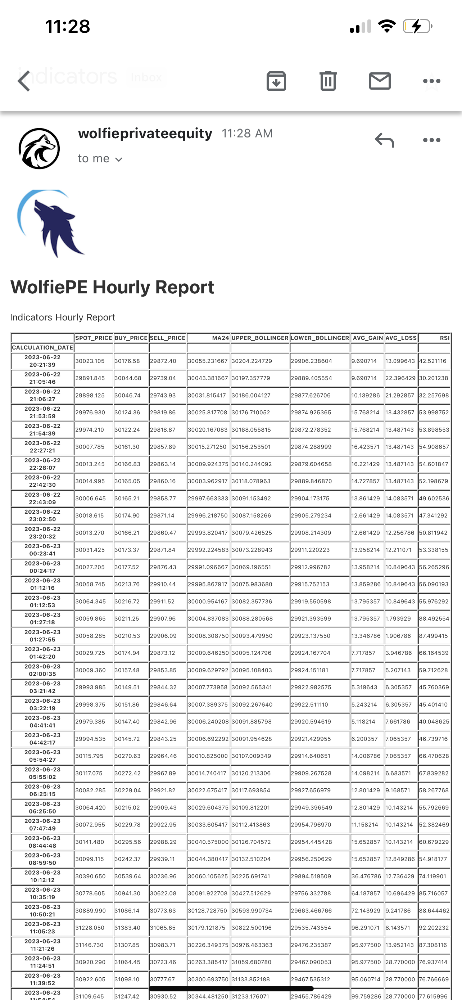
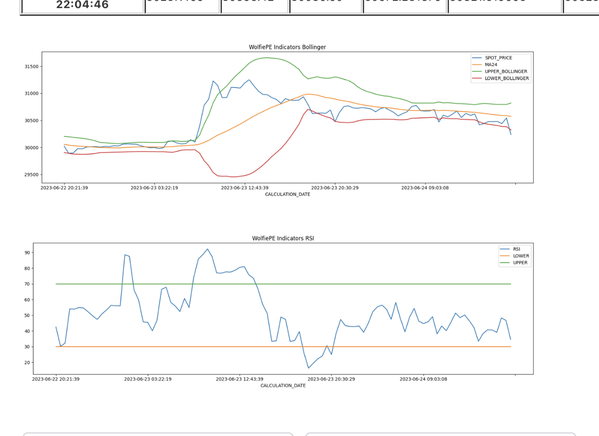
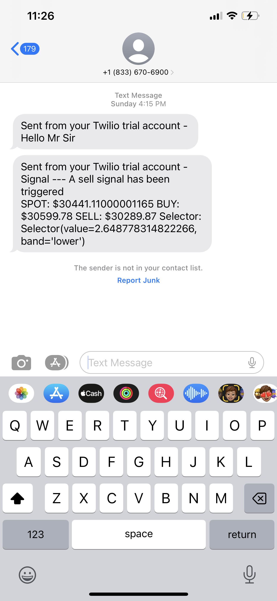

# Wolftrader
---
Application that collects BitCoin prices, calculates moving averages, uses Bollinger Bands to generate overbought and oversold signals, and uses the RSI to create **buy/sell** signals.

## Data
**Important**: You need a coinbase account
Wolftrader uses coinbase to get the price information.
Once you have an account, please configure the credentials in the file `wolftrader/resources/wolfie.ini` and section **CoinbaseProperties**.
```
[CoinbaseProperties]
coinbase.user.key=<coinbase-key>
coinbase.user.secret=<coinbase-secret>
```


## Notifications

### eMail
Wolftrader sends you a report with the current prices, the trends, and others.
To enable this feature you need a system account (a gmail created for this application) and you must creat an **app password** in the Gmail security settings.
The settings can be added in the file: `wolftrader/resources/conf/wolfie.ini` and section **EmailProperties**.
```
[EmailProperties]
gmail.account=<sys-account>@gmail.com
gmail.pass=<sys-account-password>
gmail.port=587
gmail.smtp=smtp.gmail.com
recipients=recipient1@gmail,recipient2@hotmail,recipient3@justboxeythings
```

This is a sample email from the system account you configured:




### SMS

**Important**: To use this feature you must have a Twilio account


Wolftrader uses Bollinger Bands and RSI to generate signals.
When a **buy** or **sell** signal is triggered, it sends an SMS to the phone configured in: `wolftrader/resources/conf/wolfie.ini`


in the **Twilio** section
```
[Twilio]
sid=<your-twilio-sid>
token=<twilio-token>
sender=<twilio-sender>
sms.recipients=1234567890,0987654321
```

The images below are sample SMS notifications:



To run this you need **Python 3**.

Run the script `setup.sh`. This will create a directory structure, create a virtual environment, and create a sqlite database with the schame defined in `db/create-schema.ddl`.


```
sh setup.sh
```


Finally, to run the program run the script `start-master.sh`.

```sh start-master.sh```


